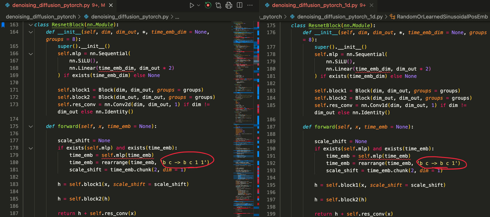

#| label: alg-test-text-style
#| html-indent-size: "1.2em"
#| html-comment-delimiter: "▷"
#| html-line-number: true
#| html-line-number-punc: ":"
#| html-no-end: false
#| pdf-placement: "H"
#| pdf-line-number: true

\begin{algorithm}
\caption{Training (DDPM)}
\begin{algorithmic}
\Repeat
  \State $t\sim \text{Uniform}(\lbrace 1,\cdots,T \rbrace)$ 
    \Comment{Sample random step}
  \State $x_0\sim q(x_0)$
    \Comment{Sample random initial image}
  \State $\overline{\varepsilon}_t\sim \mathcal{N}(\mathbf{0},\mathbf{I})$
    \Comment{Sample random noise}
  \State $x_t = \sqrt{\overline{\alpha}_t}x_0 + \sqrt{1-\overline{\alpha}_t}\cdot \overline{\varepsilon}_t$
  \State Take gradient descent step on
  $\Bigl\lVert \overline{\varepsilon}_t - \mathtt{Net}_{\theta}(x_t,t) \Bigr\rVert^2$
    \Comment{Optimization}
\Until{converged}
\end{algorithmic}
\end{algorithm}

#| label: alg-diffusion-model-sampling-shortly
#| html-indent-size: "1.2em"
#| html-comment-delimiter: "//"
#| html-line-number: true
#| html-line-number-punc: ":"
#| html-no-end: false
#| pdf-placement: "H"
#| pdf-line-number: true

\begin{algorithm}
\caption{Sampling (DDPM)}
\begin{algorithmic}
\State $x_T\sim \mathcal{N}(\mathbf{0},\mathbf{I})$ 
\For{$t=T,\cdots,1$}
  \State $z\sim \mathcal{N}(\mathbf{0},\mathbf{I})$ if $t>1,$ else $z=\mathbf{0}$
  \State $x_{t-1}=\frac{1}{\sqrt{\alpha_t}}\Big(x_t-\frac{1-\alpha_t}{\sqrt{1-\overline{\alpha}_t}}\mathtt{Net}_{\theta}(x_t,t)\Big)+\sigma_t z$
\EndFor
\Return $x_0$
\end{algorithmic}
\end{algorithm}

---

## $f$

To determine a joint density satisfies
$$
\begin{aligned}
  q(x_{0:T}) = q(x_T\vert x_0) \cdot \prod_{t=2}^T q(x_{t-1}\vert x_t, x_0) \cdot q(x_0),
\end{aligned}
$$
it suffices to determine the values of densities $q(x_0),$ $q(x_T\vert x_0)$ and
$$
\begin{aligned}
  q(x_{t-1}\vert x_t,x_0) , \quad t=2 ,\cdots ,T.
\end{aligned}
$$
That is,
if we define a joint density by
$$
\begin{aligned}
  q(x_{0:T}) := \widetilde{q}(x_T\vert x_0 ) \cdot \prod_{t=2}^T \widetilde{q}(x_{t-1}\vert x_t,x_0) \cdot \widetilde{q}(x_0),
\end{aligned}
$$
where $\widetilde{q}(x_0),\, \widetilde{q}(x_T\vert x_0)$ and $\widetilde{q}(x_{t-1}\vert x_t,x_0)$ are all densities,
then
$$
\begin{aligned}
  q(x_0) &= \widetilde{q}(x_0), \cr 
  q(x_{t-1}\vert x_t,x_0) &= \widetilde{q}(x_{t-1}\vert x_t,x_0), \quad \forall t=2,\cdots,T, \cr
  q(x_t\vert x_0) &= \widetilde{q}(x_t\vert x_0) , \quad \forall t=1,\cdots,T.
\end{aligned}
$$

---

The new measure $\mathbf{Q}_{\sigma}$ is defined by
$$
\begin{aligned}
  q_{\sigma}(x_{0:T}) := \widetilde{q_{\sigma}}(x_T\vert x_0) \cdot \prod_{t=2}^T \widetilde{q_{\sigma}}(x_{t-1}\vert x_t, x_0) \cdot q(x_0),
\end{aligned}
$$
where $\widetilde{q_{\sigma}}(x_T\vert x_0):=\mathcal{N}(\sqrt{\overline{\alpha}_T}x_0,(1-\overline{\alpha}_T)\mathbf{I})$ and
$$
\begin{aligned}
  \widetilde{q_{\sigma}} (x_{t-1}\vert x_t,x_0) := \mathcal{N}\biggl( \sqrt{\overline{\alpha}_{t-1}}x_0 + \sqrt{1-\overline{\alpha}_{t-1} - \sigma_t^2} \cdot \frac{x_t-\sqrt{\overline{\alpha}_t}x_0}{\sqrt{1-\overline{\alpha}_t}} , \sigma_t^2 \mathbf{I} \biggr), \quad t=2,\cdots, T.
\end{aligned}
$$
Note that $q_{\sigma}(x_{0:T})$ is a density since it is a product of densities.
One can show that for this joint density $q_{\sigma}(x_{0:T}),$
$$
\begin{aligned}
  q_{\sigma}(x_0) &= q(x_0), \cr
  q_{\sigma}(x_{t-1}\vert x_t,x_0) &= \widetilde{q_{\sigma}}(x_{t-1}\vert x_t,x_0) , \quad t=2,\cdots, T, \cr
  q_{\sigma} (x_t \vert x_0) &= \mathcal{N} (\sqrt{\overline{\alpha}_t}x_0, (1-\overline{\alpha}_t)\mathbf{I}) = q(x_t\vert x_0) , \quad t=1,\cdots,T.
\end{aligned}
$$

---

For $x_0,\overline{\varepsilon}_t\in \mathbb R^n$ with the relation $x_t = \sqrt{\overline{\alpha}_t} x_0 + \sqrt{1-\overline{\alpha}_t}\cdot \overline{\varepsilon}_t,$
  we can write $\mu_{t}(x_t,x_0)$ into two forms:
 
$$
\begin{aligned}
  \mu_{t}(x_t,x_0)  
  &= \frac{\sqrt{\alpha_t}(1-\overline{\alpha}_{t-1})}{1-\overline{\alpha}_t}x_t + \frac{\sqrt{\overline{\alpha}_{t-1}}\beta_t}{1-\overline{\alpha}_t}x_0  \cr 
  &= \frac{1}{\sqrt{\alpha_t}} \Bigl( 
      x_t - \frac{\beta_t}{\sqrt{1-\overline{\alpha}_t}} {\overline{\varepsilon}_t}  
  \Bigr) \stackrel{\text{denote}}{:=} \widetilde{\mu}_t(x_t,\overline{\varepsilon}_t).
\end{aligned}
$$ 

---

Want: $\mu_{\theta}(x_t,t) \approx \mu_t(x_t,x_0).$

We do not have $x_0$ term in $\mu_{\theta}.$

Try 

Try to set $\mu_{\theta}(x_t,t) = \mu_t(x_t,\widehat{x}_0)$
where $\widehat{x}_0=\widehat{x}_0(x_t,t,\theta).$

也就是找一個 $X_0$ 的替代品 $\widehat{X}_0,$ 並且讓 $\widehat{X}_0\approx X_0$ in some sense and $X_0$ is a function of $X_t$ ($X_t$-measurable).
In probability, we may choose the conditional expectation $\widehat{X}_0=\mathbb{E}_{\mathbf{Q}}\bigl[ X_0 \big\vert X_t \bigr].$

---

---

# IDEA

- p(xT) 有個 phase transition.
- 減去 mean 可以明顯讓我們 T 的選取更加小.
- 訓練的每次 batch 都先讓 mean 變 0 ?
- Fix $x_0.$ 

- 2023 11 26 
  - 如果 X0 只有 single 圖片, 那 T 選取？？
- 2023 11 27
  - 每個 class 都先做 data mean 0, T 會不會較好?
    - 去看 mnist 的每個數字 class 的 mean 是誰 
- 2023 11 30 
  - mnist + tSNE
  - UMAP
    - <https://umap-learn.readthedocs.io/en/latest/>
    - !!! <https://pair-code.github.io/understanding-umap/>
- 2023 12 04
  - 不只平移 mean 0, 如果加上 normalize to sig = 1?

- 2023 12 11 
  - Sample 時, 需要 x0 hat (用 xt, t 去表示). 這裡能否用 x0 ~ q(x0)?

- 2023 12 16
  - 能否給一張軍人照片+五星照片 合成成五星上將圖
  - 生成書法？
    - 給定文字敘述 輸出相關的書法寫作影片
  - 給一段音樂 生成對應的舞蹈骨頭軌跡

- 2023 12 21
  - 不一定每張圖只有一個 label
  - 能不能弄出一個 dm, 當指定某部位時, 那部位生成那類圖形
    - ex: 指定鬍子, 指定眼鏡 ...

- 2024 01 04

---

# TO DO 
## !!! 2023 年視覺生成式 AI 年終大回顧！！ <https://youtu.be/9AahFT8Y3lw>

## Transformer
- https://jalammar.github.io/illustrated-transformer/
- https://nlp.seas.harvard.edu/2018/04/03/attention.html

## t-SNE

SSIM(tructural Similarity): 模拟人类视觉从3个方面比较图片的结构相似度，亮度对比度跟结构
RMSE(Root Mean Square Error): MSE开根号，计算两张图片像素值的均方根误差来衡量相似度
LPIPS(Learned Perceptual Image Patch Similarity): 感知级指标，衡量图片在深度特征空间的距离
FID(Fr ́echet Inception Distance): 衡量生成图片跟真实图片在分布上的不同

@zheng2022truncated

- lineart_anime来给经典黑白本子自动上色

## Question

噪聲預測的 model (U-net) $z_\theta(x_t,t)$, ($x_t$ 是 $t$ 時間點時的圖片)

感覺 $z_\theta$ 要對 $x_t$ 這分量是近似線性的

也就是 $z_{\theta}(x_t,t)\approx \varepsilon \iff z_\theta( c\cdot x_t,t) \approx c\cdot \varepsilon, \quad c>0.$

$\bigl( x_t=\sqrt{\overline{\alpha}_t}x_0 + \sqrt{1-\overline{\alpha}_t}\varepsilon \iff c \cdot x_t=\sqrt{\overline{\alpha}_t}\cdot c\cdot x_0 + \sqrt{1-\overline{\alpha}_t}\cdot c\cdot \varepsilon \bigr).$

## Code 方面

### denoising-diffusion-pytorch

- <https://github.com/lucidrains/denoising-diffusion-pytorch>
- 1D 跟 2D 不同地方
  - 
  - `nn.Conv2d` and `nn.Conv1d`
